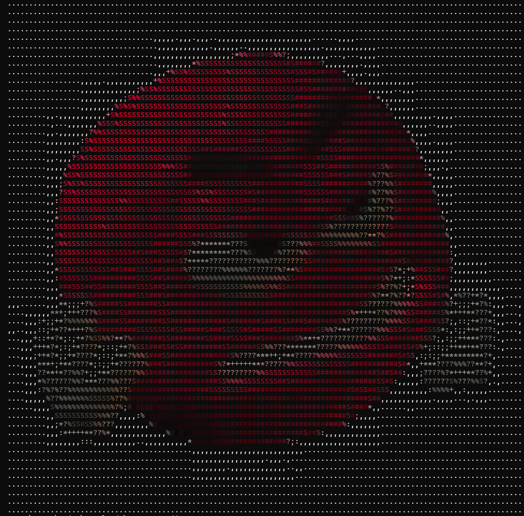
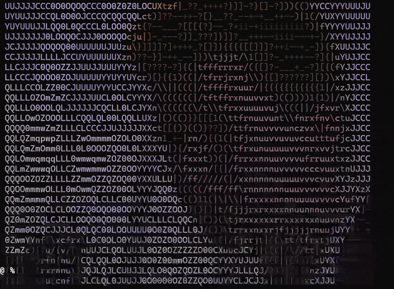

# ASCIIfy

real-time ascii art renderer built using C++, Flask, OpenCV, WebSockets

converts
1. image to ascii
2. webcam feed to live ascii art

## features
1. real-time webcam ascii rendering
2. rgb coloured output
3. fast cpp image rendering
4. ui - drag and drop, adjustable resolution
5. websocket streaming

## tech stack
### backend
- python
- flask
- flask-socketio
- opencv

### rendering engine
- c++
- stb_image

### frontend (vibe coded)
- html
- css
- js
- socket.io

## original angry m&m image


## ascii art 


## how to run on terminal
1. clone repo
    ```bash
    git clone https://github.com/anjipoo/image_to_ascii.git
    ```

2. install all requirements
    ```bash
    cd image_to_ascii
    pip install -r requirements.txt
    ```

3. for image 
    ```bash
    g++ image.cpp -o <output> 
    ```

    then
    ```bash
    ./<output> <filename> <output_width> <color/bw>
    ```

    for eg.
    ```bash
    ./image image.jpg 100 color
    ```

4. for webcam
    ```bash
    python webcam.py
    ```

## run using ui
1. run app.py
    ```bash
    python app.py
    ```
2. then open http://127.0.0.1:5000 on browser
3. the output for webcam is not rgb as of now

## video output
